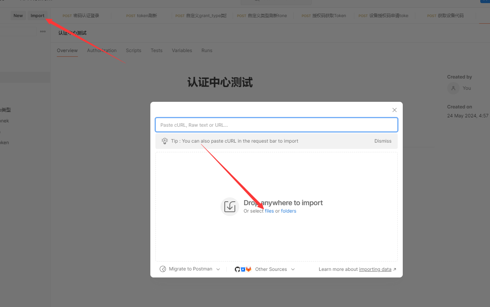

<br />

<h1 align="center">Panda.Net</h1>

<p align="center">ABP + EF Core 的微服务开源框架</p>

<p align="center">⭐ 支持 工作流 与 消息推送 ⭐</p>

<br />

<p align="center">💬 QQ 群: 240647629</p>

<br />

<p align="center">
    
    
    
    
    
    
    
</p>

<br />

## 🥇 功能列表 （持续更新）

- [x] 用户管理
- [x] 角色管理
- [x] 菜单管理
- [x] 部门管理
- [x] 登录日志
- [x] 操作日志
- [x] 系统公告
- [x] 文件上传
- [x] 定时任务
- [x] 消息推送
- [x] 工作流
- [x] 文件分片上传

## 核心技术

### 后端 C# Asp.Net Core

- [x] 动态 API：ABP
- [x] ORM 框架: EF Core
- [x] 鉴权授权：OpenIddict
- [x] 工作流：workflow-core
- [x] 日志：Serilog
- [x] 模块化：ABP
- [x] 依赖注入：Autofac
- [x] 对象映射：AutoMapper
- [x] 工作单元：ABP
- [x] 多租户：ABP
- [x] 本地缓存：ABP
- [x] 分布式缓存：Redis
- [x] 事件总线：ABP
- [x] 微服务：ABP
- [x] 消息通知：SignalR

### 前端 Vue 3
> [!NOTE]
> [前端项目开源地址](https://gitee.com/notify/panda.net.web)


- [x] 组件库：element-plus
- [x] 路由：vue-router
- [x] 存储：pinia
- [x] 打包：vite	
- [x] 异步请求：axios
- [x] 图表：echarts
- [x] 审批流：jsplumb
- [x] 拖拽：vuedraggable
- [x] 自定义表单：vue + element-plus 实现

## 项目结构

```bash
# 安装abp cli 
dotnet tool install -g Volo.Abp.Cli
# 更新abp cli
dotnet tool update -g Volo.Abp.Cli
# 创建项目	
abp new Panda.Net -u none --separate-auth-server -dbms mysql -d ef
```

### Panda.Net.AuthServer 认证中心

> [!TIP]
> 参考文档:
> 
> OpenIddict
> 
> https://note.youdao.com/s/I7rsNw8N

启动命令
```bash
dotnet Panda.Net.AuthServer.dll --urls https://localhost:44365
```
- [x] 密码模式
- [x] 授权码模式
- [x] 客户端模式
- [x] 设备码授权模式(可用于App扫码登录)
- [x] 简单模式( OAuth2.0 已弃用不再实现) 
	- 新增 postman 测试 json, 放在 `src/Panda.Net.AuthServer/postman/postman_collection.json`
	- 如图所示
	- 
 
### Panda.Net.HttpApi.Host 服务中心

> [!TIP]
> 参考文档:
> 
> Abp 扩展 User 表
> 
> https://note.youdao.com/s/7oP7XG2O

启动命令
```bash
dotnet Panda.Net.HttpApi.Host.dll --urls https://localhost:44368
```

### Panda.Workflow.HttpApi.Host 工作流

启动命令
```cmd
dotnet Panda.Workflow.HttpApi.Host.dll --urls https://localhost:44598
```

截图： 
<table>
  <tr>
    <td></td>
    <td></td>
    <td></td>
    <td></td>
  </tr>
  <tr>
    <td></td>
    <td></td>
    <td></td>
    <td></td>
  </tr>
  <tr>
    <td></td>
    <td></td>
    <td></td>
  </tr>
</table>
	
### 数据库还原

```bash
# 安装 dotnet ef cli
dotnet tool install --global dotnet-ef
# 更新 dotnet ef cli
dotnet tool update --global dotnet-ef
# 生成迁移文件
dotnet ef migrations add init -c NetDbContext
# 更新数据库
dotnet ef database update -c NetDbContext
# 生成迁移脚本 ( 用于生成环境 )
dotnet ef migrations script --verbose -i --project "存放项目绝对路径" -c NetDbContext -o "存放脚本绝对路径"
# 生成某一次迭代更新的脚本, 从这个迭代 20240329102615_file1 到 20240408082719_announcement 迭代版本之间的差异脚本
dotnet ef migrations script --verbose -i --project "./" -c NetDbContext -o "./2.sql"  20240329102615_file1 20240408082719_announcement
```
## 脚本还原
```bash
	#还原脚本
	新建数据库panda
	执行脚本 src/Panda.Net.EntityFrameworkCore/panda.sql 
```	
