<h4 align="center">Abp.vNext8.1 + EF Core8.0 的微服务开源框架</h4>
<h2 align="center">项目支持 
<span style="color:red">消息推送</span> <span style="color:red;">工作流</span><h2>
<h3 align="center">可加咨询QQ群240647629</h3>

# Panda.Net
	Abp vnext 项目
## 
## 其他地址
* [前端地址](https://gitee.com/notify/panda.net.web)
* [Abp.vNext官网](https://docs.abp.io/zh-Hans/abp/latest/)
##  核心技术
#### 后端
C# Asp.NetCore 8.0
- [x] 动态Api：Abp.vNext
- [x] 鉴权授权：Jwt
- [x] 日志：Serilog
- [x] 模块化：Abp.vNext
- [x] 依赖注入：Autofac
- [x] 对象映射：AutoMapper
- [x] ORM: EF8.0
- [x] 多租户：Abp.vNext
- [x] 本地缓存：Abp.vNext
- [x] 分布式缓存：Abp.vNext
- [x] 事件总线：Abp.vNext
- [x] 微服务：Abp.vNext
- [x] 消息通知：SignalR
- [x] 工作单元：Abp.vNext

#### 前端
 Vue3.4
- [x] 异步请求：axios
- [x] 图表：echarts
- [x] ui：element-plus
- [x] 存储：pinia
- [x] 路由：vue-router
- [x] 打包：vite	
- [x] 审批流：jsplumb
- [x] 拖拽：vuedraggable
- [x] 自定义表单：vue + element-plus 实现

#### 功能列表 （持续更新）
- [x] 用户管理
- [x] 角色管理
- [x] 菜单管理
- [x] 部门管理
- [x] 登录日志
- [x] 操作日志
- [x] 系统公告
- [x] 文件上传
- [x] 定时任务
- [x] 消息推送
- [x] <font color="#FF0000">工作流</font>
- [x] <font color="#FF0000">文件分片上传</font>

## 项目创建
```bash
	#安装abp cli 
	dotnet tool install -g Volo.Abp.Cli
	#更新abp cli
	dotnet tool update -g Volo.Abp.Cli
	#创建项目	
	abp new Panda.Net -u none --separate-auth-server -dbms mysql -d ef
```
## Panda.Net.AuthServer
### 认证中心
	启动命令 dotnet Panda.Net.AuthServer.dll --urls https://localhost:44365
	参考文档 OpenIddict:https://note.youdao.com/s/I7rsNw8N
- [x] 密码模式
- [x] 授权码模式
- [x] 客户端模式
- [x] 设备码授权模式(可用于App扫码登录)
- [x] 简单模式(OAuth2.0已弃用不在实现)
	新增postman测试json  放在src/Panda.Net.AuthServer/postman/postman_collection.json
	如图所示
	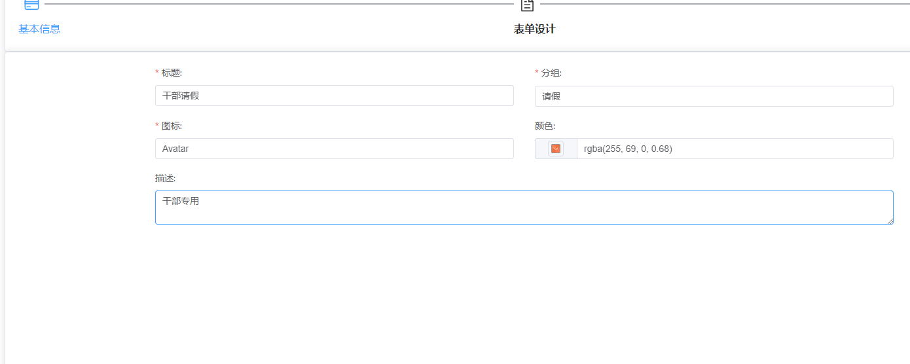
## Panda.Net.HttpApi.Host
### 服务中心
	启动命令 dotnet Panda.Net.HttpApi.Host.dll --urls https://localhost:44368
	参考文档 AbpVnext扩展User表:https://note.youdao.com/s/7oP7XG2O	
## Panda.Workflow.HttpApi.Host
	启动命令 dotnet Panda.Workflow.HttpApi.Host.dll --urls https://localhost:44598

#### 审批流截图： 
 <table>
    <tr>
        <td></td>
    </tr>
    <tr>
         <td>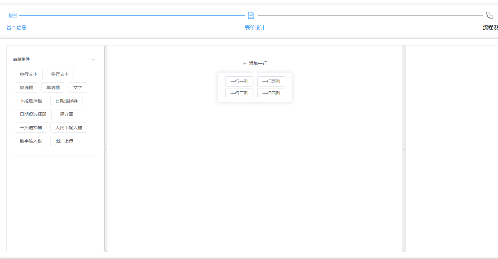</td>
    </tr>
	 <tr>
         <td>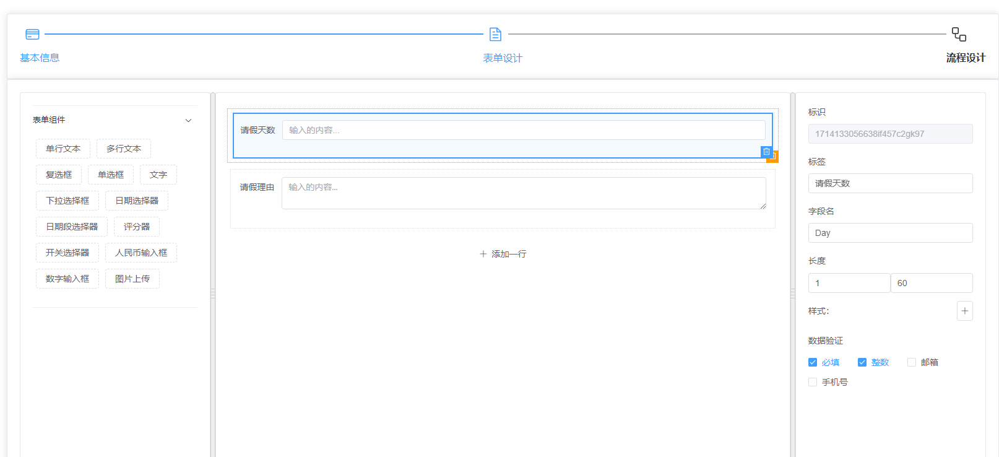</td>
    </tr>
	 <tr>
         <td>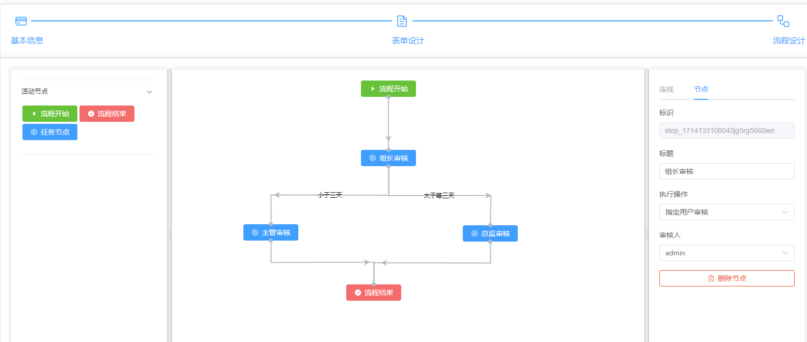</td>
    </tr>
	 <tr>
         <td>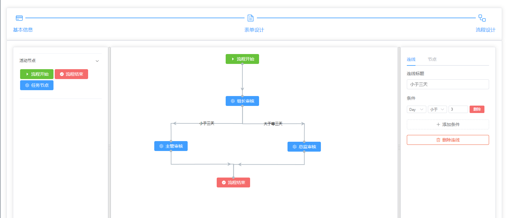</td>
    </tr>
	 <tr>
         <td>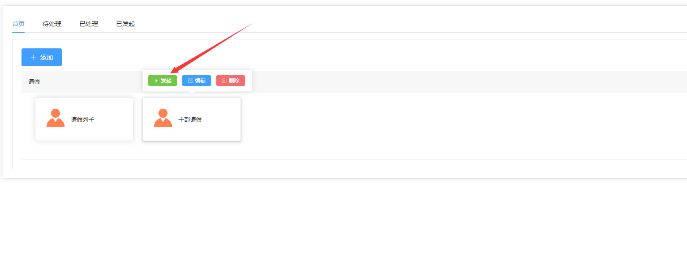</td>
    </tr>
	 <tr>
         <td>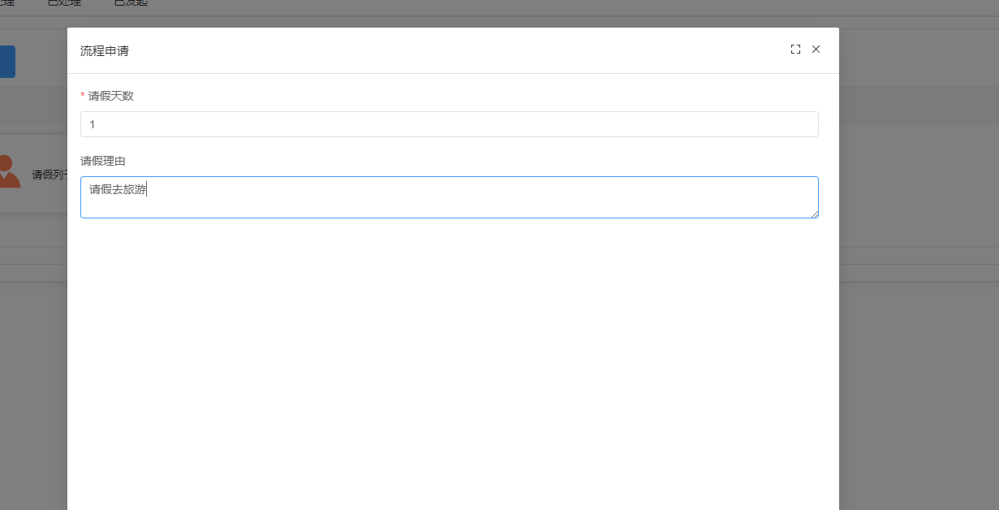</td>
    </tr>
	 <tr>
         <td>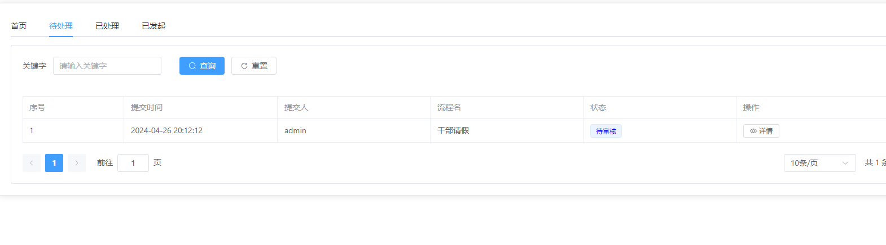</td>
    </tr>
	 <tr>
         <td>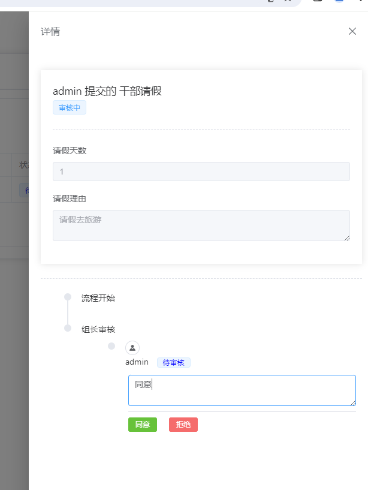</td>
    </tr>
	 <tr>
         <td>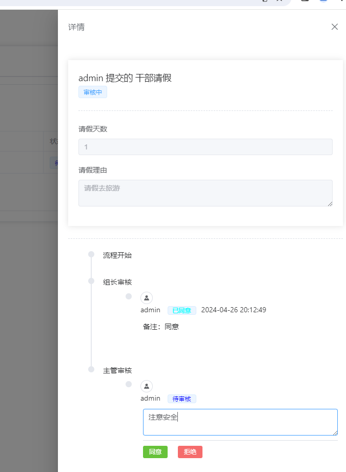</td>
    </tr>
	 <tr>
         <td>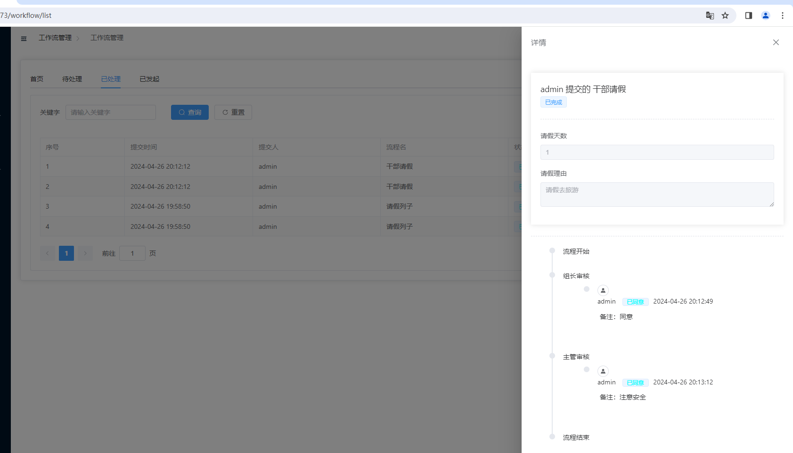</td>
    </tr>
</table>

### 工作流服务	
## 数据库还原
```bash
	#安装dotnet ef cli
	dotnet tool install --global dotnet-ef
	#更新dotnet ef cli
	dotnet tool update --global dotnet-ef
	# 生成迁移文件
	dotnet ef migrations add init -c NetDbContext
	# 更新数据库
	dotnet ef database update -c NetDbContext
	# 生成迁移脚本(用于生成环境)
	dotnet ef migrations script --verbose -i --project "存放项目绝对路径" -c NetDbContext -o "存放脚本绝对路径"
	# 生成某一次迭代更新的脚本
	从这个迭代 20240329102615_file1 到 20240408082719_announcement迭代版本之间的差异脚本
	dotnet ef migrations script --verbose -i --project "./" -c NetDbContext -o "./2.sql"  20240329102615_file1 20240408082719_announcement
```
	